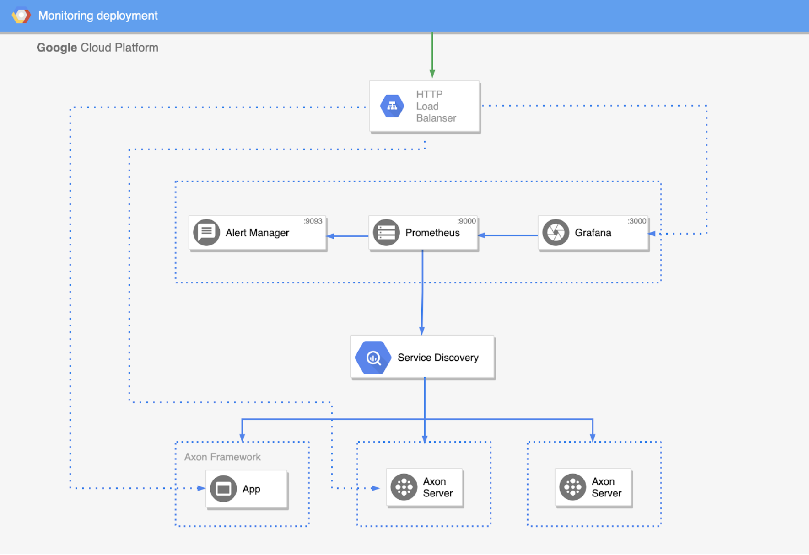

# Introduction

Please watch [full webinar](https://www.youtube.com/watch?v=bVJjZ9IS9pA) that explains all parts of this demo project.

# Axon  monitoring

Monitoring stack includes Prometheus, Grafana & Alert manager.
Metrics from Axon Framework and Axon Server will be scraped by Prometheus.

## Provisioning

All monitoring configuration, alerts, dashboards, datasource are maintained as code in this repo. 

### How to add new dashboards
To create a dashboard you will need to type a PromQL expression into Grafana.
You can check this simple guide on how to do so: https://timber.io/blog/promql-for-humans/

After creating new dashboard in Grafana UI use the export button to export dashboard as a Json string.

Create a json file with dashboard name in `src/main/resources/grafana/dashboards/` and paste exported json code.


### How to add new alerts

Alerts rules and PromQL expression are defined in `prometheus/alert.rules`

Check this guide on how to start writing alert rules:
https://prometheus.io/docs/prometheus/latest/configuration/alerting_rules/

#### Provisioning files:
- `alertmanager/alertmanager.yml` has placeholder for webhook API URL and slack channel name.
- `grafana/dashboards` is a folder that contains all Grafana dashboards, saved as Json files. To update dashboard or create new ones, update/create a dashboard in Grafana, then export it as a Json file and place it in this directory. 
- `grafana/provisioning/dashboards/dashboards.yml` contains configuration of the Grafana dashboards. This includes path to dashboards folder, disable UI editing, update interval etc...
- `grafana/provisioning/datasources/datasources.yml` contains data source configuration for Grafana. In our case default data source is our Prometheus service.
- `prometheus/prometheus.yml` contains scraping and service discovery configuration for Alert Manager and all scraped services. Also defines a path to the alert rules.
- `prometheus/alert.rules` defines metric rules when alerts should be sent.

## Production deployment




_Diagram above describes dependencies of the Monitoring stack that is deployed in GCE._


------

**Prometheus requires persistent disk to store metrics.**

------

## Deployment

Full monitoring stack can be deployed locally using `docker-compose`.

Demo app image is built using Jib Maven plugin. Before running monitoring stack be sure to run `mvn clean package` to have the latest images available.

Monitoring stack images are built from Dockerfiles which add necessary provisioning configuration to the images.

------

To run Monitoring stack, inside docker directory first run:

`mvn clean package` - to build Demo app image

`docker-compose build` - creates required images and add all provisioning configuration to Monitoring stack.

`docker-compose up` - to start all the services


------

Above steps will run monitoring stack and: 

Prometheus Service will run in a new container on:  http://localhost:9090

AlertManager will run in a new container on: http://localhost:9093

Grafana will run in a new container on: http://localhost:3000

Demo app will run in a new container on: http://localhost:8080 while actuator is available on  http://localhost:8081/actuator


# Axon Server

Please read [Reference guide](https://docs.axoniq.io/reference-guide/axon-server/administration/monitoring/grpc-metrics)

To expose metrics for Axon Server, enable following property
`axoniq.axonserver.metrics.grpc.enabled=true`

To make use of gRPC dashboards enable gRPC metrics
`axoniq.axonserver.metrics.grpc.prometheus-enabled=true`

## Metrics

## `axon_event`
Counts total number of events processed since start
Tags: context

- `axon_event_count` (Counter) - Number of event stored since start
- `axon_event_rate_oneMinuteRate` (Gauge) - Number of event stored per second (last minute)
- `axon_event_rate_fiveMinuteRate` (Gauge) - Number of event stored per second (last 5 minutes)
- `axon_event_rate_fifteenMinuteRate` (Gauge) - Number of event stored per second (last 15 minutes)

## `axon_event_lastToken`
(Gauge) Last event token in event store 
Tags: context


## `axon_snapshot`
Counts total number of snapshots processed since start
Tags: context

- `axon_snapshot_count` (Counter) - Number of snapshots stored per second, since start
- `axon_snapshot_rate_oneMinuteRate` (Gauge) - Number of snapshots stored per second (last minute)
- `axon_snapshot_rate_fiveMinuteRate` (Gauge) - Number of snapshots stored per second (last 5 minutes)
- `axon_snapshot_rate_fifteenMinuteRate` (Gauge) - Number of snapshots stored per second(last 15 minutes)

## `axon_snapshot_lastToken`
(Gauge) Last snapshot token in event store
Tags: context

## `axon_commands_active`
(Gauge) - Number of pending commands waiting to be completed
Tags: context

## `axon_command`
Counts total number of commands processed since start
Tags: context

- `axon_command_count` (Counter) - Number of commands sent since start
- `axon_command_rate_oneMinuteRate` (Gauge) - Number of commands sent per second (last minute)
- `axon_command_rate_fiveMinuteRate` (Gauge) - Number of commands sent per second (last 5 minutes)
- `axon_command_rate_fifteenMinuteRate` (Gauge) - Number of commands sent per second (last 15 minutes)


## `axon_commands_seconds`
(Timer) Registers the duration of a command in the registry
Tags: context, request, quantile, source, target

- `axon_commands_seconds_sum` -  Total time of all calls
- `axon_commands_seconds_count` - Total number of all calls
- `axon_commands_seconds_max` - Maximum recorded duration of command handler


## `axon_queries_active`
(Gauge) - Number of pending queries. Queries waiting in the registry to be completed
Tags: context


## `axon_queries_seconds`
(Timer) Registers the duration of a query in the registry
Tags: context, request, quantile, source, target

- `axon_queries_seconds_sum` -  Total time of all calls
- `axon_queries_seconds_count` - Total number of all calls
- `axon_commands_seconds_max` - Maximum recorded duration of query handler

## `axon_query`
Counts total number of queries processed since start
Tags: context

- `axon_query_count` (Counter) - Number of queries sent since start
- `axon_query_rate_oneMinuteRate` (Gauge) - Number of queries sent per second (last minute)
- `axon_query_rate_fiveMinuteRate` (Gauge) - Number of queries sent per second (last 5 minutes)
- `axon_query_rate_fifteenMinuteRate` (Gauge) - Number of queries sent per second (last 15 minutes)

## `axon_GlobalSubscriptionMetricRegistry`
Counts total number of subscription queries
Tags: context

- `axon_GlobalSubscriptionMetricRegistry_active` (Gauge) - total number of subscription queries currently active
- `axon_GlobalSubscriptionMetricRegistry_total` (Counter) - total number of subscription queries since start
- `axon_GlobalSubscriptionMetricRegistry_updates_total` (Counter) - total number of updates emitted since start

## `disk`
Reports usable and total space for each registered storage. Path is reported as mounting point of the disk
Tags: instance,path

- `disk_free` (Gauge) - Usable space for storage (event, snapshot, log storage) (bytes)
- `disk_total` (Gauge) - Total space for storage (event, snapshot, log storage) (bytes)


# Axon Framework metrics

Please read [Reference guide](https://docs.axoniq.io/reference-guide/axon-framework/monitoring-and-metrics#metrics)

The following monitor implementations are currently provided (prometheus format):

- MessageCountingMonitor (Counter) - Counts the number of ingested, successful, failed, ignored and processed messages (`ingested=processed+ignored; processed=success+failure`).
  Commands will actually never get ignored. It’s a generic component that is used in all messaging parts.
  For an event processor, it’s normal to ignore an event. It could be an event for which there is no handler, or an event that is to be processed in another thread/segment.
  Queries are ignored if the handlers cannot provide a response that matches the expected response type
  - `commandBus_ingestedCounter_total{app="demo-app",payloadType="IssueCmd",} 3000.0`
  - `commandBus_processedCounter_total{app="demo-app",payloadType="IssueCmd",} 2999.0`
  - `commandBus_successCounter_total{app="demo-app",payloadType="IssueCmd",} 2998.0`
  - `commandBus_failureCounter_total{app="demo-app",payloadType="IssueCmd",} 1.0`
  - `commandBus_ignoredCounter_total{app="demo-app",payloadType="IssueCmd",} 1.0`
  - `queryBus_ingestedCounter_total{app="demo-app",payloadType="IssueCmd",} 3000.0`
  - `queryBus_processedCounter_total{app="demo-app",payloadType="IssueCmd",} 2999.0`
  - `queryBus_successCounter_total{app="demo-app",payloadType="IssueCmd",} 2998.0`
  - `queryBus_failureCounter_total{app="demo-app",payloadType="IssueCmd",} 1.0`
  - `queryBus_ignoredCounter_total{app="demo-app",payloadType="IssueCmd",} 1.0`
  - `eventStore_successCounter_total{app="demo-app",} 3030.0`
  - `eventStore_ignoredCounter_total{app="demo-app",} 0.0`
  - `eventStore_processedCounter_total{app="demo-app",} 3030.0`
  - `eventStore_ingestedCounter_total{app="demo-app",} 3030.0`
  - `eventStore_failureCounter_total{app="demo-app",} 0.0`
  - `eventProcessor_ingestedCounter_total{app="demo-app",payloadType="IssuedEvt",processorName="com.demo.query",} 3030.0`  
  - `eventProcessor_failureCounter_total{app="demo-app",payloadType="IssuedEvt",processorName="com.demo.query",} 0.0`
  - `...`
    
- CapacityMonitor (Gauge) - Measures message capacity by keeping track of the total time spent on message handling compared to total time it is active.
  This returns a number between 0 and n number of threads. Thus, if there are 4 threads working, the maximum capacity is 4 if every thread is active 100% of the time.
    - `commandBus_capacity{app="demo-app",payloadType="IssueCmd",} 0.03`
    - `queryBus_capacity{app="demo-app",payloadType="FindAllGiftCardQry",} 0.08491664214833333`
    - `eventProcessor_capacity{app="demo-app",payloadType="IssuedEvt",processorName="com.demo.query",} 0.0`

- MessageTimerMonitor (Timer) - Keeps a timer for all successful, failed and ignored messages, as well as an overall timer for all three combined.
  - `commandBus_failureTimer_seconds{app="demo-app",payloadType="IssueCmd",quantile="0.5",} 0.0`
  - `commandBus_ignoredTimer_seconds{app="demo-app",payloadType="IssueCmd",quantile="0.5",} 0.0`
  - `commandBus_successTimer_seconds{app="demo-app",payloadType="IssueCmd",quantile="0.5",} 0.2`
  - `commandBus_allTimer_seconds{app="demo-app",payloadType="IssueCmd",quantile="0.5",} 0.2`
  - `queryBus_successTimer_seconds{app="demo-app",payloadType="IssueCmd",quantile="0.5",} 0.0`
  - `queryBus_successTimer_seconds{app="demo-app",payloadType="IssueCmd",quantile="0.5",} 0.0`
  - `eventProcessor_allTimer_seconds{app="demo-app",payloadType="IssuedEvt",processorName="com.demo.query",quantile="0.5",} 0.0`
  - `eventStore_successTimer_seconds{app="demo-app",payloadType="IssuedEvt",quantile="0.5",} 0.0`  
  - `...`  

- EventProcessorLatencyMonitor (Gauge) - Measures the difference in message timestamps between the last ingested and the last processed event message.
  - `eventProcessor_latency{app="demo-app",payloadType="IssuedEvt",processorName="com.demo.query",} 4.0`

## Dimensions

By enabling dimensions in `application.properties` (`axon.metrics.micrometer.dimensional=true`) you would be able to slice metrics per `payloadTpe` and `processorName` by default.

The scenario might occur that more fine-grained control over which dimensions/tags are configured. 
For example, you may want to slice metrics peer user/role that is publishing particular message: *"how many commands are published by a particular `user/role`"*.
`User/Role` can be a part of the message metadata.

```java
@Bean
    public ConfigurerModule metricConfigurer(MeterRegistry meterRegistry) {
        return configurer -> {
            instrumentEventStore(meterRegistry, configurer);
        };
    }

    private void instrumentEventStore(MeterRegistry meterRegistry, Configurer configurer) {
        MessageMonitorFactory messageMonitorFactory = (configuration, componentType, componentName) -> {
            // Registering the counter with custom tags/dimensions: PAYLOAD_TYPE_TAG and all the message metadata.
            MessageCountingMonitor messageCounter = MessageCountingMonitor.buildMonitor(
                    componentName, meterRegistry,
                    message -> Tags.of(TagsUtil.PAYLOAD_TYPE_TAG, message.getPayloadType().getSimpleName())
                                   .and(message.getMetaData().entrySet().stream()
                                               .map(s -> Tag.of(s.getKey(), s.getValue().toString()))
                                               .collect(Collectors.toList()))
            );
            // Registering the Timer with custom tags: payloadType.
            MessageTimerMonitor messageTimer = MessageTimerMonitor.buildMonitor(
                    componentName, meterRegistry,
                    message -> Tags.of(TagsUtil.PAYLOAD_TYPE_TAG, message.getPayloadType().getSimpleName())
            );
            return new MultiMessageMonitor<>(messageCounter, messageTimer);
        };
        configurer.configureMessageMonitor(EventStore.class, messageMonitorFactory);
    }
```

## Roadmap

- We plan to create more specific Grafana dashboards for Axon Framework applications that are using micrometer/dimensional metrics (`axon.metrics.micrometer.dimensional=true`).
  - slicing all messaging components by `payloadType`
  - including general graphs for all event processors, sliced by `processorName`
  - adding more general graphs to measure memory, cpu, db pools and other metrics, on the same dashboard. This way you can easily correlate.
  - visualize capacity in a better way. Y-axis could show percentage, rather than the total number of threads that are busy.
- Be more specific about alerting
  - at what point you should be worried: you are reaching capacity of almost 100 % over a longer period of time. Time to handle particular messages is high (> 5 sec)...
  - examples on how to configure alert manager
